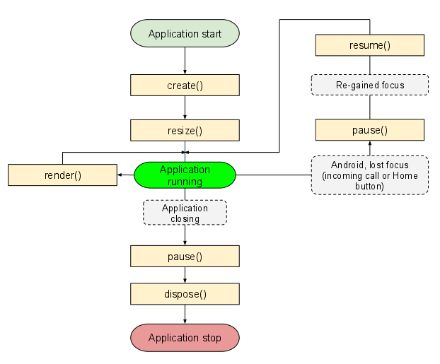

## 静态类

Gdx.app : 代表一个游戏应用的实例，通常在平台的启动器中被实例化并启动API客户端（core 子项目可以看做是 API 客户端）。该接口实例会将应用程序层面的事件通知API客户端，比如窗口大小的改变。Application 还提供了日志输出系统和各种查询方法，例如内存的使用情况，操作系统版本信息，获取系统剪贴板等。
Gdx.files : 暴露平台底层的文件系统，提供统一的对文件操作的抽象接口。
Gdx.input : 通知 API 客户端用户的输入，例如鼠标点击，键盘按键按下，触摸屏幕和传感器事件。同时还支持轮询和事件驱动处理。
Gdx.net : 提供一个跨平台的通过 HTTP/HTTPS 访问资源的方法，还可以创建 TCP 服务和客户端 sockets。
Gdx.audio : 可用于创建音效和音乐实例，提供重放音效和音乐的方法，同时可以直接访问 PCM 音频的输入输出设备。
Gdx.graphics : 暴露 OpenGL ES 2.0 接口。还提供查询帧率，渲染时间步，获取屏幕宽高等方法。

## 生命周期

create()： 当应用被创建时调用一次。
resize(int width, int height)： 游戏屏幕尺寸改变并且不处于暂停状态将被调用，在 create() 方法之后也会被调用一次。
render()： ApplicationListener 中的游戏循环渲染方法，每时每刻都在被调用。游戏逻辑的更新通常也是在这个方法中被执行。
pause()： 当游戏界面被新的一个界面覆盖时（例如按下 Home 键回到主界面时被主界面覆盖，来电时被来电界面覆盖），该方法将被调用。通常在这里保存暂停时的游戏状态。
resume()： 被其他界面覆盖后（pause 状态后），重新回到游戏界面时，该方法被调用。
dispose()： 当应用被销毁时调用。




## 主要类

### Texture

Texture(纹理) : 解码一个图片文件并加载到 GPU 内存，可以代表为一张图片

```java
Texture img = new Texture("badlogic.jpg");
// 获取图片的长和宽
int height = img.getHeight();
int width = img.getWidth();
// 销毁
img.dispose();
```

### SpriteBatch

SpriteBatch(精灵批处理) : 将纹理绘制到屏幕上，坐标原点为屏幕左下角，X 轴正方向水平向左，Y 轴正方向水平向上

```java
import com.badlogic.gdx.ApplicationAdapter;
import com.badlogic.gdx.Gdx;
import com.badlogic.gdx.graphics.Texture;
import com.badlogic.gdx.graphics.g2d.SpriteBatch;
import com.badlogic.gdx.utils.ScreenUtils;

public class SpriteBatchStudy extends ApplicationAdapter {
    
	SpriteBatch batch;
    
	Texture img;
	
	@Override
	public void create () {
        // 初始化
		batch = new SpriteBatch();
		img = new Texture("badlogic.jpg");
    }

	@Override
	public void render () {
        // 清屏
		ScreenUtils.clear(0, 0, 0, 0);
        // 开始
		batch.begin();
        // 绘制
		batch.draw(img, 0, 0);
        // 结束
		batch.end();
	}
	
	@Override
	public void dispose () {
        // 销毁
		batch.dispose();
		img.dispose();
	}
}
```

### Pixmap 

 Pixmap :  支撑加载图片，像素和绘制图形

```java
import com.badlogic.gdx.ApplicationAdapter;
import com.badlogic.gdx.Gdx;
import com.badlogic.gdx.graphics.Color;
import com.badlogic.gdx.graphics.Pixmap;
import com.badlogic.gdx.graphics.Texture;
import com.badlogic.gdx.graphics.g2d.SpriteBatch;
import com.badlogic.gdx.utils.ScreenUtils;

public class PixmapStudy extends ApplicationAdapter {

    SpriteBatch batch;

    Pixmap pixmap;

    Texture imgPixmap;

    @Override
    public void create() {
        batch = new SpriteBatch();
		
        // 创建一个宽高都为 256, 像素点颜色值格式为 RGBA8888(每个像素颜色值占 4 个字节) 的 Pixmap
        pixmap = new Pixmap(256, 256, Pixmap.Format.RGBA8888);

        // 设置绘图颜色为白色
        pixmap.setColor(1, 1, 1, 1);
        // 将整个 pixmap 填充为当前设置的颜色
        pixmap.fill();

        // 设置绘图颜色为红色
        pixmap.setColor(1, 0, 0, 1);
        // 画一个空心圆
        pixmap.drawCircle(64, 64, 32);

        // 设置绘图颜色为绿色
        pixmap.setColor(Color.GREEN);
        // 画一条线段, 线段两点为 (0, 0) 到 (256, 128)
        pixmap.drawLine(0, 0, 256, 128);

        // 设置绘图颜色为蓝色
        pixmap.setColor(Color.BLUE);
        // 画一个矩形, 矩形左上角坐标(128, 128), 宽高均为64
        pixmap.drawRectangle(128, 128, 64, 64);

        // 设置绘图颜色为黄色
        pixmap.setColor(Color.YELLOW);
        // 填充一个三角形, 三点(0, 256), (0, 128), (128, 128)
        pixmap.fillTriangle(0, 256, 0, 128, 128, 128);

        // pixmap 处理完成后转换成纹理
        imgPixmap = new Texture(pixmap);

        // pixmap 已不再需要用到, 释放资源
        pixmap.dispose();
    }
	
    @Override
    public void render() {
        ScreenUtils.clear(0, 0, 0, 1);
        batch.begin();
        batch.draw(imgPixmap, Gdx.graphics.getWidth() - 256, 0);
        batch.end();
    }

    @Override
    public void dispose() {
        batch.dispose();
        imgPixmap.dispose();
    }
}
```

### TextureRegion

TextureRegion(纹理区域) : 表示 Texture(纹理）的一部分矩形区域，坐标原点为Texture左上角，X 轴正方向水平向左，Y 轴正方向水平向下

```java
import com.badlogic.gdx.ApplicationAdapter;
import com.badlogic.gdx.graphics.Texture;
import com.badlogic.gdx.graphics.g2d.SpriteBatch;
import com.badlogic.gdx.graphics.g2d.TextureRegion;
import com.badlogic.gdx.utils.ScreenUtils;

public class TextureRegionStudy extends ApplicationAdapter {

    SpriteBatch batch;

    Texture img;

    TextureRegion imgRegion;

    @Override
    public void create() {
        batch = new SpriteBatch();
        img = new Texture("badlogic.jpg");
        imgRegion = new TextureRegion(img, 0, 0, 128, 128);
    }

    @Override
    public void render() {
        ScreenUtils.clear(0, 0, 0, 1);
        batch.begin();
        batch.draw(imgRegion, 0, 0);
        batch.end();
    }

    @Override
    public void dispose() {
        batch.dispose();
        img.dispose();
    }
}
```

### Sprite

Sprite(精灵) : 继承TextureRegion，比Texture更强大，Sprite = Texture/TextrueRegion + 属性（坐标，缩放比，旋转角度，是否X / Y轴方向取镜像，透明度/颜色 等）

```java
import com.badlogic.gdx.ApplicationAdapter;
import com.badlogic.gdx.graphics.Texture;
import com.badlogic.gdx.graphics.g2d.Sprite;
import com.badlogic.gdx.graphics.g2d.SpriteBatch;
import com.badlogic.gdx.utils.ScreenUtils;

public class SpriteStudy extends ApplicationAdapter {

    SpriteBatch batch;

    Texture img;

    Sprite sprite;

    @Override
    public void create() {
        batch = new SpriteBatch();
        img = new Texture("badlogic.jpg");
        sprite = new Sprite(img, 0, 0, 128, 128);
        // 位置
        sprite.setPosition(64, 128);
        // 设置 旋转 和 缩放 的 起点
        sprite.setOrigin(0, 0);
        // 设置旋转角度
        sprite.setRotation(15.0f);
        // 设置精灵的 X 和 Y 轴方向的缩放比
        sprite.setScale(0.5f, 0.5f);
        // 设置精灵在水平方向取镜像, 竖直方不取镜像
        sprite.flip(true, false);
    }

    @Override
    public void render() {
        ScreenUtils.clear(0, 0, 0, 1);
        batch.begin();
        sprite.draw(batch);
        batch.end();
    }

    @Override
    public void dispose() {
        batch.dispose();
        img.dispose();
    }
}
```

### Actor

是 2D 场景中的基本图节点（元素）。一个演员实例拥有位置（position），矩形尺寸（rectangular size），缩放和旋转的支点（origin），缩放比（scale），旋转角度（rotation），在舞台中的绘制顺序（origin），颜色 / 透明度（color）等属性。

```java
import com.badlogic.gdx.ApplicationAdapter;
import com.badlogic.gdx.Gdx;
import com.badlogic.gdx.graphics.Texture;
import com.badlogic.gdx.graphics.g2d.Batch;
import com.badlogic.gdx.graphics.g2d.SpriteBatch;
import com.badlogic.gdx.graphics.g2d.TextureRegion;
import com.badlogic.gdx.scenes.scene2d.Actor;
import com.badlogic.gdx.utils.ScreenUtils;

public class ActorStudy extends ApplicationAdapter {

    SpriteBatch batch;

    Texture img;

    CustomActor actor;
    
    @Override
    public void create() {
        batch = new SpriteBatch();
        img = new Texture("badlogic.jpg");
        actor = new CustomActor(new TextureRegion(img));
        // 位置
        actor.setPosition(64, 128);
        // 设置 旋转 和 缩放 的 起点
        actor.setOrigin((float) img.getHeight() / 2, (float) img.getWidth() / 2);
        // 设置旋转角度
        actor.setRotation(-45.0f);
        // 设置精灵的 X 和 Y 轴方向的缩放比
        actor.setScale(0.6f, 0.6f);
    }

    @Override
    public void render() {
        ScreenUtils.clear(0, 0, 0, 1);
        actor.act(Gdx.graphics.getDeltaTime());
        batch.begin();
        actor.draw(batch, 1.0f);
        batch.end();
    }

    @Override
    public void dispose() {
        batch.dispose();
        img.dispose();
    }

    public static class CustomActor extends Actor {

        private TextureRegion region;

        public CustomActor(TextureRegion region) {
            super();
            this.region = region;
            // 将演员的宽高设置为纹理区域的宽高（必须设置, 否则宽高默认都为 0, 绘制后看不到）
            setSize(this.region.getRegionWidth(), this.region.getRegionHeight());
        }

        public TextureRegion getRegion() {
            return region;
        }

        public void setRegion(TextureRegion region) {
            this.region = region;
            setSize(this.region.getRegionWidth(), this.region.getRegionHeight());
        }

        @Override
        public void act(float delta) {
            super.act(delta);
        }

        @Override
        public void draw(Batch batch, float parentAlpha) {
            super.draw(batch, parentAlpha);
            if (region == null || !isVisible()) {
                return;
            }
            batch.draw(region, getX(), getY(),
                    getOriginX(), getOriginY(),
                    getWidth(), getHeight(),
                    getScaleX(), getScaleY(),
                    getRotation()
            );
        }
    }
}
```

### Stage

舞台（Stage）是众多演员（Actor）“表演”的地方，可以看做是一个包含不同层次演员的 2D 场景，能够处理视口（整体缩放显示 / 屏幕适配）和 接收输入事件（触屏，鼠标点击，按键按下等）自己处理以及将事件分发给演员。

方法

float getWidth()： 获取舞台的宽度
float getHeight()： 获取舞台的高度
void act(float delta)： 更新舞台逻辑，并批处理舞台中的演员（自动逐个调用演员的 act() 方法更新演员逻辑）
void draw()： 绘制舞台，并批处理舞台中的演员（自动逐个调用演员的 draw() 方法绘制演员）
void dispose() : 释放舞台中的所有资源
boolean addListener(EventListener listener)： 添加事件监听到舞台
boolean removeListener(EventListener listener)： 移除监听器
void addActor(Actor actor)： 增加一个演员到舞台中
void clear()： 移除舞台中的所有演员
Array<Actor> getActors()： 获取舞台中的所有演员
Group getRoot()： 获取舞台中维护所有演员的演员组

```java
import com.badlogic.gdx.ApplicationAdapter;
import com.badlogic.gdx.Gdx;
import com.badlogic.gdx.graphics.Texture;
import com.badlogic.gdx.graphics.g2d.Batch;
import com.badlogic.gdx.graphics.g2d.TextureRegion;
import com.badlogic.gdx.scenes.scene2d.Actor;
import com.badlogic.gdx.scenes.scene2d.Stage;
import com.badlogic.gdx.utils.ScreenUtils;

public class StageStudy extends ApplicationAdapter {

    Texture img;

    ActorStudy.CustomActor actor;

    Stage stage;

    @Override
    public void create() {
        img = new Texture("badlogic.jpg");
        actor = new ActorStudy.CustomActor(new TextureRegion(img));
        stage = new Stage();
        stage.addActor(actor);
        // 位置
        actor.setPosition(64, 128);
        // 设置 旋转 和 缩放 的 起点
        actor.setOrigin((float) img.getHeight() / 2, (float) img.getWidth() / 2);
        // 设置旋转角度
        actor.setRotation(-45.0f);
        // 设置精灵的 X 和 Y 轴方向的缩放比
        actor.setScale(0.6f, 0.6f);
    }

    @Override
    public void render() {
        ScreenUtils.clear(0, 0, 0, 1);
        actor.act(Gdx.graphics.getDeltaTime());
        stage.act();
        stage.draw();
    }

    @Override
    public void dispose() {
        stage.dispose();
        img.dispose();
    }

    public static class CustomActor extends Actor {

        private TextureRegion region;

        public CustomActor(TextureRegion region) {
            super();
            this.region = region;
            // 将演员的宽高设置为纹理区域的宽高（必须设置, 否则宽高默认都为 0, 绘制后看不到）
            setSize(this.region.getRegionWidth(), this.region.getRegionHeight());
        }

        public TextureRegion getRegion() {
            return region;
        }

        public void setRegion(TextureRegion region) {
            this.region = region;
            setSize(this.region.getRegionWidth(), this.region.getRegionHeight());
        }

        @Override
        public void act(float delta) {
            super.act(delta);
        }

        @Override
        public void draw(Batch batch, float parentAlpha) {
            super.draw(batch, parentAlpha);
            if (region == null || !isVisible()) {
                return;
            }
            batch.draw(region, getX(), getY(),
                    getOriginX(), getOriginY(),
                    getWidth(), getHeight(),
                    getScaleX(), getScaleY(),
                    getRotation()
            );
        }
    }
}
```

为Stage和actor添加事件监听器

```java
import com.badlogic.gdx.ApplicationAdapter;
import com.badlogic.gdx.Gdx;
import com.badlogic.gdx.Input;
import com.badlogic.gdx.graphics.Texture;
import com.badlogic.gdx.graphics.g2d.Batch;
import com.badlogic.gdx.graphics.g2d.TextureRegion;
import com.badlogic.gdx.scenes.scene2d.Actor;
import com.badlogic.gdx.scenes.scene2d.InputEvent;
import com.badlogic.gdx.scenes.scene2d.InputListener;
import com.badlogic.gdx.scenes.scene2d.Stage;
import com.badlogic.gdx.scenes.scene2d.utils.ClickListener;
import com.badlogic.gdx.utils.ScreenUtils;

public class StagePlusStudy extends ApplicationAdapter {

    private static final String TAG = StagePlusStudy.class.getSimpleName();

    Texture img;

    CustomActor actor;

    Stage stage;

    @Override
    public void create() {
        img = new Texture("badlogic.jpg");
        actor = new CustomActor(new TextureRegion(img));
        stage = new Stage();
        stage.addActor(actor);
        // 位置
        actor.setPosition(64, 128);
        // 设置 旋转 和 缩放 的 起点
        actor.setOrigin((float) img.getHeight() / 2, (float) img.getWidth() / 2);
        // 设置旋转角度
        actor.setRotation(-45.0f);
        // 设置精灵的 X 和 Y 轴方向的缩放比
        actor.setScale(0.6f, 0.6f);

        Gdx.input.setInputProcessor(stage);
        stage.addListener(new CustomInputListener());
        actor.addListener(new CustomClickListener());
    }

    @Override
    public void render() {
        ScreenUtils.clear(0, 0, 0, 1);
        actor.act(Gdx.graphics.getDeltaTime());
        stage.act();
        stage.draw();
    }

    @Override
    public void dispose() {
        stage.dispose();
        img.dispose();
    }

    public static class CustomInputListener extends InputListener {

        @Override
        public boolean keyDown(InputEvent event, int keycode) {
            switch (keycode) {
                case Input.Keys.UP: {
                    Gdx.app.log(TAG, "被按下的按键: 方向上键");
                    break;
                }
                case Input.Keys.DOWN: {
                    Gdx.app.log(TAG, "被按下的按键: 方向下键 ");
                    break;
                }
                case Input.Keys.A: {
                    Gdx.app.log(TAG, "被按下的按键: A键");
                    break;
                }
                case Input.Keys.ENTER: {
                    Gdx.app.log(TAG, "被按下的按键: 回车键");
                    break;
                }
                default: {
                    Gdx.app.log(TAG, "其他按键, KeyCode: " + keycode);
                    break;
                }
            }
            return false;
        }
    }

    /**
     * 点击 监听器（只包括 手指点击 或 鼠标点击）
     */
    public static class CustomClickListener extends ClickListener {

        /**
         * 对象（演员/舞台）被点击时调用
         * @param x 点击时（手指抬起时）的 X 轴坐标, 相对于被点击对象（监听器注册者）的左下角
         * @param y 点击时（手指抬起时）的 Y 轴坐标, 相对于被点击对象（监听器注册者）的左下角
         */
        @Override
        public void clicked(InputEvent event, float x, float y) {
            // 获取响应这个点击事件的演员
            Actor actor = event.getListenerActor();
            Gdx.app.log(TAG, "被点击: " + x + ", " + y + "; Actor: " + actor.getClass().getSimpleName());
        }
    }

    public static class CustomActor extends Actor {

        private TextureRegion region;

        public CustomActor(TextureRegion region) {
            super();
            this.region = region;
            // 将演员的宽高设置为纹理区域的宽高（必须设置, 否则宽高默认都为 0, 绘制后看不到）
            setSize(this.region.getRegionWidth(), this.region.getRegionHeight());
        }

        public TextureRegion getRegion() {
            return region;
        }

        public void setRegion(TextureRegion region) {
            this.region = region;
            setSize(this.region.getRegionWidth(), this.region.getRegionHeight());
        }

        @Override
        public void act(float delta) {
            super.act(delta);
        }

        @Override
        public void draw(Batch batch, float parentAlpha) {
            super.draw(batch, parentAlpha);
            if (region == null || !isVisible()) {
                return;
            }
            batch.draw(region, getX(), getY(),
                    getOriginX(), getOriginY(),
                    getWidth(), getHeight(),
                    getScaleX(), getScaleY(),
                    getRotation()
            );
        }
    }
}
```

### Group

演员组类（Group）表示的是一组演员，可以包含多个不同层次演员，将多个演员添加到组中作为演员的父节点对多个演员统一管理。Group 类继承自 Actor，本质上也是一样演员，Group 是对于 Actor 的增强封装。实际上 Group 中维护了一个数组用于存放添加到组中的演员，在绘制时根据数组中的顺序依次绘制演员。

常用方法

void addActor(Actor actor)： 将演员作为子节点添加到组中。
void addActorAfter(Actor actorAfter, Actor actor)： 在已在组中的演员 actorAfter 的索引位置后面添加演员 actor。绘制时 actorAfter 先绘制，actor 后绘制。
void addActorBefore(Actor actorBefore, Actor actor)： 在已在组中的演员 actorBefore 的索引位置前面添加演员 actor。绘制时 actor 先绘制，actorBefore 后绘制。
void addActorAt(int index, Actor actor)： 在指定索引位置添加一个演员（索引越大先后绘制，即越显示在屏幕前面）。
boolean removeActor(Actor actor)： 移除组中的一个演员。
boolean swapActor(Actor first, Actor second)： 交换组中两个演员的位置。
boolean swapActor(int first, int second)： 根据索引交换组中两个演员的位置。
void clearChildren()： 移除组中所有演员。
void clear()： 移除组中所有演员，组的所有动作和监听。
SnapshotArray<Actor> getChildren()： 获取组中所有的演员。

```java
import com.badlogic.gdx.ApplicationAdapter;
import com.badlogic.gdx.Gdx;
import com.badlogic.gdx.graphics.Texture;
import com.badlogic.gdx.graphics.g2d.Batch;
import com.badlogic.gdx.graphics.g2d.TextureRegion;
import com.badlogic.gdx.scenes.scene2d.Actor;
import com.badlogic.gdx.scenes.scene2d.Group;
import com.badlogic.gdx.scenes.scene2d.Stage;
import com.badlogic.gdx.utils.ScreenUtils;

public class GroupStudy extends ApplicationAdapter {

    Texture img;

    Group group;

    CustomActor actor;

    CustomActor actor2;

    Stage stage;

    @Override
    public void create() {
        img = new Texture("badlogic.jpg");
        stage = new Stage();
        group = new Group();

        actor = new CustomActor(new TextureRegion(img));
        // 位置
        actor.setPosition(0, 0);
        // 设置 旋转 和 缩放 的 起点
        actor.setOrigin(0,0);
        // 设置旋转角度
        actor.setRotation(-45.0f);
        group.addActor(actor);

        actor2 = new CustomActor(new TextureRegion(img));
        // 位置
        actor2.setPosition(100, 100);
        // 设置 旋转 和 缩放 的 起点
        actor2.setOrigin((float) img.getHeight(), (float) img.getWidth());
        // 设置旋转角度
        actor2.setRotation(45.0f);
        group.addActor(actor2);

        stage.addActor(group);

    }

    @Override
    public void render() {
        ScreenUtils.clear(0, 0, 0, 1);
        actor.act(Gdx.graphics.getDeltaTime());
        stage.act();
        stage.draw();
    }

    @Override
    public void dispose() {
        stage.dispose();
        img.dispose();
    }

    public static class CustomActor extends Actor {

        private TextureRegion region;

        public CustomActor(TextureRegion region) {
            super();
            this.region = region;
            // 将演员的宽高设置为纹理区域的宽高（必须设置, 否则宽高默认都为 0, 绘制后看不到）
            setSize(this.region.getRegionWidth(), this.region.getRegionHeight());
        }

        public TextureRegion getRegion() {
            return region;
        }

        public void setRegion(TextureRegion region) {
            this.region = region;
            setSize(this.region.getRegionWidth(), this.region.getRegionHeight());
        }

        @Override
        public void act(float delta) {
            super.act(delta);
        }

        @Override
        public void draw(Batch batch, float parentAlpha) {
            super.draw(batch, parentAlpha);
            if (region == null || !isVisible()) {
                return;
            }
            batch.draw(region, getX(), getY(),
                    getOriginX(), getOriginY(),
                    getWidth(), getHeight(),
                    getScaleX(), getScaleY(),
                    getRotation()
            );
        }
    }
}
```

### Screen

场景（Screen）是游戏框架中舞台（Stage）的父节点，一个场景可以理解为一个游戏界面，类似 Android 中的 Activity，一个游戏由多个场景（界面）组成，通常包括开始界面、游戏/关卡界面、帮助界面等。一个场景中可以包含一个或多个舞台。

```java
import com.badlogic.gdx.Game;
import com.badlogic.gdx.Gdx;
import com.badlogic.gdx.Screen;
import com.badlogic.gdx.ScreenAdapter;
import com.badlogic.gdx.graphics.GL20;
import com.badlogic.gdx.graphics.Texture;
import com.badlogic.gdx.graphics.g2d.Batch;
import com.badlogic.gdx.graphics.g2d.TextureRegion;
import com.badlogic.gdx.scenes.scene2d.Actor;
import com.badlogic.gdx.scenes.scene2d.Stage;
import com.badlogic.gdx.utils.ScreenUtils;

public class ScreenStudy extends Game {

    public static final float WORLD_WIDTH = 480;
    public static final float WORLD_HEIGHT = 800;

    // 开始场景
    private StartScreen startScreen;

    // 主游戏场景
    private GameScreen gameScreen;

    @Override
    public void create() {
        // 创建开始场景
        startScreen = new StartScreen(this);

        // 创建主游戏场景
        gameScreen = new GameScreen();

        // 设置当前场景为开始场景
        setScreen(startScreen);
    }

    /**
     * 开始场景展示完毕后调用该方法切换到主游戏场景
     */
    public void showGameScreen() {
        // 设置当前场景为主游戏场景
        setScreen(gameScreen);

        if (startScreen != null) {
            // 由于 StartScreen 只有在游戏启动时展示一下, 之后都不需要展示,
            // 所以启动完 GameScreen 后手动调用 StartScreen 的 dispose() 方法销毁开始场景。
            startScreen.dispose();

            // 场景销毁后, 场景变量值空, 防止二次调用 dispose() 方法
            startScreen = null;
        }
    }

    @Override
    public void dispose() {
        super.dispose(); // super.dispose() 不能删除, 在父类中还有其他操作（调用当前场景的 hide 方法）
        // 游戏程序退出时, 手动销毁还没有被销毁的场景
        if (startScreen != null) {
            startScreen.dispose();
            startScreen = null;
        }
        if (gameScreen != null) {
            gameScreen.dispose();
            gameScreen = null;
        }
    }

    public static class GameScreen extends ScreenAdapter {

        Texture img;

        CustomActor actor;

        Stage stage;

        public GameScreen() {
            img = new Texture("badlogic.jpg");
            stage = new Stage();
            actor = new CustomActor(new TextureRegion(img));
            // 位置
            actor.setPosition(0, 0);
            stage.addActor(actor);
        }

        @Override
        public void render(float delta) {
            ScreenUtils.clear(0, 0, 0, 1);
            stage.act();
            stage.draw();
        }

        @Override
        public void dispose() {
            stage.dispose();
            img.dispose();
        }
    }

    public static class StartScreen implements Screen {

        private ScreenStudy mainGame;

        private Texture logo;

        private Stage stage;

        private GroupStudy.CustomActor actor;

        private float deltaSum;

        public StartScreen(ScreenStudy mainGame) {
            this.mainGame = mainGame;
            stage = new Stage();
            logo = new Texture("img.png");
            actor = new GroupStudy.CustomActor(new TextureRegion(logo));
            actor.setPosition(
                    stage.getWidth() / 2 - actor.getWidth() / 2,
                    stage.getHeight() / 2 - actor.getHeight() / 2);
            stage.addActor(actor);

        }

        @Override
        public void show() {
            deltaSum = 0;
        }

        @Override
        public void render(float v) {
            deltaSum += v;
            if (deltaSum >= 3.0f) {
                if (mainGame != null) {
                    mainGame.showGameScreen();
                    return;
                }
            }
            // 使用淡蓝色清屏
            Gdx.gl.glClearColor(0.75F, 1, 0.98F, 1);
            Gdx.gl.glClear(GL20.GL_COLOR_BUFFER_BIT);

            // 更新舞台逻辑
            stage.act();
            // 绘制舞台
            stage.draw();
        }

        @Override
        public void resize(int i, int i1) {

        }

        @Override
        public void pause() {

        }

        @Override
        public void resume() {

        }

        @Override
        public void hide() {

        }

        @Override
        public void dispose() {
            logo.dispose();
            stage.dispose();
        }
    }

    public static class CustomActor extends Actor {

        private TextureRegion region;

        public CustomActor(TextureRegion region) {
            super();
            this.region = region;
            // 将演员的宽高设置为纹理区域的宽高（必须设置, 否则宽高默认都为 0, 绘制后看不到）
            setSize(this.region.getRegionWidth(), this.region.getRegionHeight());
        }

        public TextureRegion getRegion() {
            return region;
        }

        public void setRegion(TextureRegion region) {
            this.region = region;
            setSize(this.region.getRegionWidth(), this.region.getRegionHeight());
        }

        @Override
        public void act(float delta) {
            super.act(delta);
        }

        @Override
        public void draw(Batch batch, float parentAlpha) {
            super.draw(batch, parentAlpha);
            if (region == null || !isVisible()) {
                return;
            }
            batch.draw(region, getX(), getY(),
                    getOriginX(), getOriginY(),
                    getWidth(), getHeight(),
                    getScaleX(), getScaleY(),
                    getRotation()
            );
        }
    }
}
```


